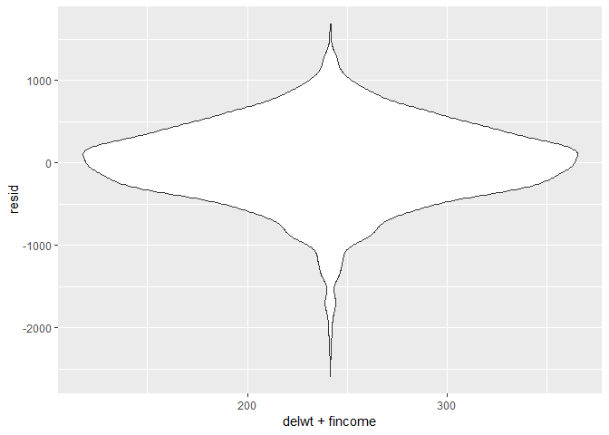
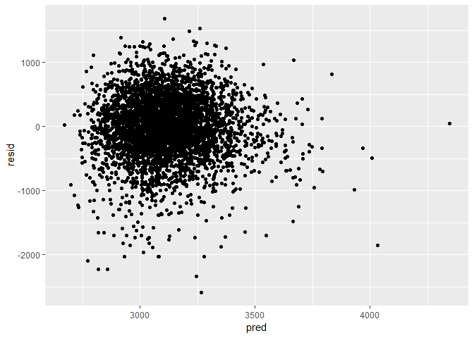
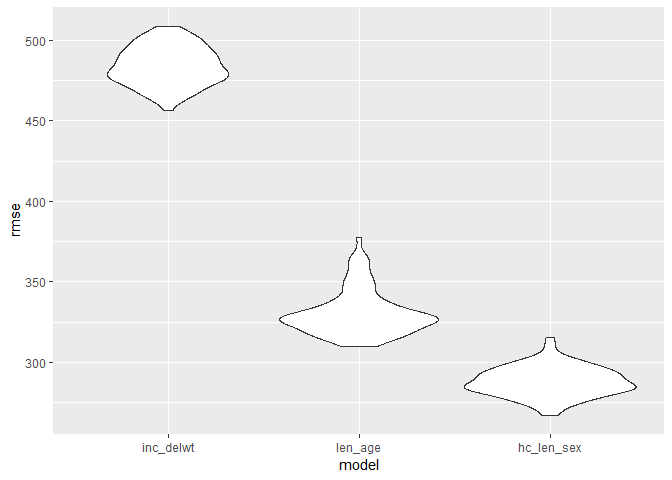

p8105\_hw6\_ph2538
================
Pei Yang Hsieh
2018-11-26

The purpose of this file is to complete homework 6.

## Problem 1

### Tidying Data

Create a city\_state variable (e.g. “Baltimore, MD”), and a binary
variable indicating whether the homicide is solved. Omit cities Dallas,
TX; Phoenix, AZ; and Kansas City, MO – these don’t report victim race.
Also omit Tulsa, AL – this is a data entry mistake. Modifiy victim\_race
to have categories white and non-white, with white as the reference
category. Be sure that victim\_age is numeric.

``` r
homicide_data = read_csv(file = "./homicide-data.csv")
```

    ## Parsed with column specification:
    ## cols(
    ##   uid = col_character(),
    ##   reported_date = col_integer(),
    ##   victim_last = col_character(),
    ##   victim_first = col_character(),
    ##   victim_race = col_character(),
    ##   victim_age = col_character(),
    ##   victim_sex = col_character(),
    ##   city = col_character(),
    ##   state = col_character(),
    ##   lat = col_double(),
    ##   lon = col_double(),
    ##   disposition = col_character()
    ## )

``` r
#create city_state variable and omit certain cities
homicide_data =
  homicide_data %>% 
  mutate(city_state = str_c(city, ", ", state)) %>% 
  filter(city_state != "Dallas, TX", city_state != "Phoenix, AZ", city_state != "Kansas City, MO", city_state != "Tulsa, AL") 

#create binary variable
homicide_data = 
  homicide_data %>% 
  mutate(hom_solved = recode(disposition, "Closed by arrest" = "Yes", "Closed without arrest" = "No", "Open/No arrest" = "No")) %>%
  mutate(hom_solved = as.factor(hom_solved))

#modify victim_race to binary category. Note that "Unknown" race is included in Non-white category.
homicide_data = 
  homicide_data %>% 
  mutate(victim_race = recode(victim_race, 'White' = "White", 'Hispanic' = "Non_white", 'Other' = "Non_white", 'Black' = "Non_white", 'Asian' = "Non_white", 'Unknown' = "Non_white")) %>% 
  mutate(victim_race = fct_relevel(victim_race, "White"))

#change victim_age to numeric
homicide_data = 
  homicide_data %>% 
  mutate(victim_age = as.numeric(victim_age))
```

    ## Warning in evalq(as.numeric(victim_age), <environment>): NAs introduced by
    ## coercion

### GLM on Baltimore, MD

For the city of Baltimore, MD, use the glm function to fit a logistic
regression with resolved vs unresolved as the outcome and victim age,
sex and race (as just defined) as predictors. Save the output of glm as
an R object; apply the broom::tidy to this object; and obtain the
estimate and confidence interval of the adjusted odds ratio for solving
homicides comparing nonwhite victims to white victims keeping all other
variables fixed.

``` r
Baltimore_df = 
  homicide_data %>% 
  filter(city_state == "Baltimore, MD") %>% 
  select(hom_solved, victim_age, victim_race, victim_sex)

Baltimore_glm = 
  Baltimore_df %>% 
  glm(hom_solved ~ victim_age + victim_race + victim_sex, data = ., family = binomial()) %>% 
  broom::tidy() %>% 
  mutate(OR = exp(estimate)) %>%
  mutate(conf.low = exp(estimate - (1.96 * std.error)), 
         conf.high = exp(estimate + (1.96 * std.error))) %>% 
  select(term, log_OR = estimate, OR, p.value, conf.low, conf.high) %>% 
  filter(term == "victim_raceNon_white") %>% 
  knitr::kable(digits = 3)

Baltimore_glm  
```

| term                   | log\_OR |    OR | p.value | conf.low | conf.high |
| :--------------------- | ------: | ----: | ------: | -------: | --------: |
| victim\_raceNon\_white |  \-0.82 | 0.441 |       0 |    0.313 |      0.62 |

The adjusted OR for solving homicides comparing nonwhite victims to
white victims is 0.441.

### GLM on all cities

Now run glm for each of the cities in your dataset, and extract the
adjusted odds ratio (and CI) for solving homicides comparing nonwhite
victims to white victims. Do this within a “tidy” pipeline, making use
of purrr::map, list columns, and unnest as necessary to create a
dataframe with estimated ORs and CIs for each city.

``` r
all_cities_df = 
  homicide_data %>% 
  select(city_state, hom_solved, victim_age, victim_race, victim_sex)

all_cities_glm = 
  all_cities_df %>% 
  group_by(city_state) %>% 
  nest() %>% 
  mutate(all_cities_output = map(data, ~glm(hom_solved ~ victim_age + victim_race + victim_sex, data = ., family = binomial())),
  all_cities_output = map(all_cities_output, broom::tidy)) %>% 
  select(-data) %>% 
  unnest() %>% 
  mutate(OR = exp(estimate)) %>%
  mutate(conf.low = exp(estimate - (1.96 * std.error)), 
         conf.high = exp(estimate + (1.96 * std.error))) %>% 
  select(city_state, term, log_OR = estimate, OR, p.value, conf.low, conf.high) %>% 
  filter(term == "victim_raceNon_white")

all_cities_glm
```

    ## # A tibble: 47 x 7
    ##    city_state     term            log_OR    OR  p.value conf.low conf.high
    ##    <chr>          <chr>            <dbl> <dbl>    <dbl>    <dbl>     <dbl>
    ##  1 Albuquerque, ~ victim_raceNo~ -0.299  0.741  2.38e-1   0.451      1.22 
    ##  2 Atlanta, GA    victim_raceNo~ -0.284  0.753  3.17e-1   0.432      1.31 
    ##  3 Baltimore, MD  victim_raceNo~ -0.820  0.441  2.68e-6   0.313      0.620
    ##  4 Baton Rouge, ~ victim_raceNo~ -0.404  0.668  2.96e-1   0.313      1.43 
    ##  5 Birmingham, AL victim_raceNo~  0.0385 1.04   8.86e-1   0.615      1.76 
    ##  6 Boston, MA     victim_raceNo~ -2.17   0.115  1.72e-6   0.0472     0.278
    ##  7 Buffalo, NY    victim_raceNo~ -0.942  0.390  2.31e-3   0.213      0.715
    ##  8 Charlotte, NC  victim_raceNo~ -0.584  0.558  3.83e-2   0.321      0.969
    ##  9 Chicago, IL    victim_raceNo~ -0.576  0.562  2.07e-5   0.431      0.733
    ## 10 Cincinnati, OH victim_raceNo~ -1.14   0.318  4.28e-5   0.184      0.551
    ## # ... with 37 more rows

### Plot estimates and CIs on all cities

Create a plot that shows the estimated ORs and CIs for each city.
Organize cities according to estimated OR, and comment on the plot.

``` r
Plot_all_cities =
  all_cities_glm %>% 
  ggplot(aes(fct_reorder(city_state, OR), OR)) +
  geom_point() +
  geom_errorbar(aes(ymin = conf.low, ymax = conf.high)) +
  labs(
    title = "Estimated ORs and CIs for All Cities",
    x = "City",
    y = "Estimated ORs"
  )  +
  theme(axis.text.x = element_text(angle = 90)) 

Plot_all_cities
```

The plot shows the estimated ORs and respective confidence intervals for
all cities. It shows that for Boston, the odds of solving homicides
comparing nonwhite victims to white victims is the lowest compared to
all the other cities. In contrast, Tampa, FL has the highest OR.

## Problem 2

Load and clean the data for regression analysis (i.e. convert numeric to
factor where appropriate, check for missing data, etc.).

``` r
birthweight_data = read_csv(file = "./birthweight.csv")
```

    ## Parsed with column specification:
    ## cols(
    ##   .default = col_integer(),
    ##   gaweeks = col_double(),
    ##   ppbmi = col_double(),
    ##   smoken = col_double()
    ## )

    ## See spec(...) for full column specifications.

``` r
birthweight_data = 
  birthweight_data %>%
  mutate(babysex = as.factor(babysex), frace = as.factor(frace), malform = as.factor(malform), 
         mrace = as.factor(mrace))
```

### Build a model

Propose a regression model for birthweight. This model may be based on a
hypothesized structure for the factors that underly birthweight, on a
data-driven model-building process, or a combination of the two.

Describe your modeling process.

``` r
mod_inc_delwt = 
  birthweight_data %>%
  select(bwt, fincome, delwt)

lm_inc_delwt = lm(bwt ~ fincome + delwt, mod_inc_delwt)

lm_inc_delwt %>% 
  broom::tidy() %>% 
  select(term, estimate, p.value) %>% 
  knitr::kable(digits = 3)
```

| term        | estimate | p.value |
| :---------- | -------: | ------: |
| (Intercept) | 2039.098 |       0 |
| fincome     |    2.852 |       0 |
| delwt       |    6.523 |       0 |

``` r
modelr::add_residuals(mod_inc_delwt, lm_inc_delwt)
```

    ## # A tibble: 4,342 x 4
    ##      bwt fincome delwt  resid
    ##    <int>   <int> <int>  <dbl>
    ##  1  3629      35   177  336. 
    ##  2  3062      65   156 -180. 
    ##  3  3345      85   148   98.1
    ##  4  3062      55   157 -158. 
    ##  5  3374       5   156  303. 
    ##  6  3374      55   129  337. 
    ##  7  2523      96   126 -612. 
    ##  8  2778       5   140 -189. 
    ##  9  3515      85   146  281. 
    ## 10  3459      75   169  104. 
    ## # ... with 4,332 more rows

``` r
modelr::add_predictions(mod_inc_delwt, lm_inc_delwt)
```

    ## # A tibble: 4,342 x 4
    ##      bwt fincome delwt  pred
    ##    <int>   <int> <int> <dbl>
    ##  1  3629      35   177 3293.
    ##  2  3062      65   156 3242.
    ##  3  3345      85   148 3247.
    ##  4  3062      55   157 3220.
    ##  5  3374       5   156 3071.
    ##  6  3374      55   129 3037.
    ##  7  2523      96   126 3135.
    ##  8  2778       5   140 2967.
    ##  9  3515      85   146 3234.
    ## 10  3459      75   169 3355.
    ## # ... with 4,332 more rows

This is a linear regression model of birthweight with family income and
mother’s weight at delivery as predictors. I hypothesized that both of
these variables may be associated with birthweight. For instance, family
income may reflect a family’s resources and mother’s weight may be an
indication of mother’s nutritional status and health.

### Plot model

``` r
mod_inc_delwt %>% 
  modelr::add_residuals(lm_inc_delwt) %>% 
  ggplot(aes(x = delwt + fincome, y = resid)) + geom_violin()
```

<!-- -->

This plot shows that most of the residuals fall around 0 for mother’s
weight at delivery plus family income, which means it may be a good
model.

### Plot of model residuals against fitted values

Show a plot of model residuals against fitted values – use
add\_predictions and add\_residuals in making this plot.

``` r
birthweight_data %>% 
  modelr::add_residuals(lm_inc_delwt) %>% 
  modelr::add_predictions(lm_inc_delwt) %>% 
  ggplot(aes(x = pred, y = resid)) + geom_point()
```

<!-- -->

This plot shows that most points cluster (around resid = 0 and pred =
3100), which indicates that it may be a good model.

### Creating 2 other models

Compare your model to two others: One using length at birth and
gestational age as predictors (main effects only) One using head
circumference, length, sex, and all interactions (including the
three-way interaction) between these.

``` r
mod_len_age = 
  birthweight_data %>%
  select(bwt, blength, gaweeks)

lm_len_age = lm(bwt ~ blength + gaweeks, mod_len_age)

lm_len_age %>% 
  broom::tidy() %>% 
  select(term, estimate, p.value) %>% 
  knitr::kable(digits = 3)
```

| term        |   estimate | p.value |
| :---------- | ---------: | ------: |
| (Intercept) | \-4347.667 |       0 |
| blength     |    128.556 |       0 |
| gaweeks     |     27.047 |       0 |

``` r
modelr::add_residuals(mod_len_age, lm_len_age)
```

    ## # A tibble: 4,342 x 4
    ##      bwt blength gaweeks  resid
    ##    <int>   <int>   <dbl>  <dbl>
    ##  1  3629      51    39.9  341. 
    ##  2  3062      48    25.9  538. 
    ##  3  3345      50    39.9  186. 
    ##  4  3062      52    40   -357. 
    ##  5  3374      52    41.6  -88.4
    ##  6  3374      52    40.7  -64.0
    ##  7  2523      46    40.3 -133. 
    ##  8  2778      49    37.4 -185. 
    ##  9  3515      52    40.3   87.8
    ## 10  3459      50    40.7  278. 
    ## # ... with 4,332 more rows

``` r
modelr::add_predictions(mod_len_age, lm_len_age)
```

    ## # A tibble: 4,342 x 4
    ##      bwt blength gaweeks  pred
    ##    <int>   <int>   <dbl> <dbl>
    ##  1  3629      51    39.9 3288.
    ##  2  3062      48    25.9 2524.
    ##  3  3345      50    39.9 3159.
    ##  4  3062      52    40   3419.
    ##  5  3374      52    41.6 3462.
    ##  6  3374      52    40.7 3438.
    ##  7  2523      46    40.3 2656.
    ##  8  2778      49    37.4 2963.
    ##  9  3515      52    40.3 3427.
    ## 10  3459      50    40.7 3181.
    ## # ... with 4,332 more rows

``` r
mod_hc_len_sex = 
  birthweight_data %>%
  select(bwt, bhead, blength, babysex)

lm_hc_len_sex = lm(bwt ~ bhead + blength + babysex + bhead*blength + bhead*babysex + blength*babysex + bhead*blength*babysex, mod_hc_len_sex)

lm_hc_len_sex %>% 
  broom::tidy() %>% 
  select(term, estimate, p.value) %>% 
  knitr::kable(digits = 3)
```

| term                   |   estimate | p.value |
| :--------------------- | ---------: | ------: |
| (Intercept)            | \-7176.817 |   0.000 |
| bhead                  |    181.796 |   0.000 |
| blength                |    102.127 |   0.000 |
| babysex2               |   6374.868 |   0.000 |
| bhead:blength          |    \-0.554 |   0.478 |
| bhead:babysex2         |  \-198.393 |   0.000 |
| blength:babysex2       |  \-123.773 |   0.000 |
| bhead:blength:babysex2 |      3.878 |   0.000 |

``` r
modelr::add_residuals(mod_hc_len_sex, lm_hc_len_sex)
```

    ## # A tibble: 4,342 x 5
    ##      bwt bhead blength babysex  resid
    ##    <int> <int>   <int> <fct>    <dbl>
    ##  1  3629    34      51 2        335. 
    ##  2  3062    34      48 1         59.2
    ##  3  3345    36      50 2       -157. 
    ##  4  3062    34      52 1       -274. 
    ##  5  3374    34      52 2        -11.8
    ##  6  3374    33      52 1        191. 
    ##  7  2523    33      46 2       -178. 
    ##  8  2778    33      49 2       -187. 
    ##  9  3515    36      52 1       -127. 
    ## 10  3459    33      50 1        444. 
    ## # ... with 4,332 more rows

``` r
modelr::add_predictions(mod_hc_len_sex, lm_hc_len_sex)
```

    ## # A tibble: 4,342 x 5
    ##      bwt bhead blength babysex  pred
    ##    <int> <int>   <int> <fct>   <dbl>
    ##  1  3629    34      51 2       3294.
    ##  2  3062    34      48 1       3003.
    ##  3  3345    36      50 2       3502.
    ##  4  3062    34      52 1       3336.
    ##  5  3374    34      52 2       3386.
    ##  6  3374    33      52 1       3183.
    ##  7  2523    33      46 2       2701.
    ##  8  2778    33      49 2       2965.
    ##  9  3515    36      52 1       3642.
    ## 10  3459    33      50 1       3015.
    ## # ... with 4,332 more rows

### Comparing 3 models

Make this comparison in terms of the cross-validated prediction error;
use crossv\_mc and functions in purrr as appropriate.

``` r
cv_df = 
  crossv_mc(birthweight_data, 100) 

cv_df = 
  cv_df %>% 
  mutate(mod_inc_delwt = map(train, ~lm(bwt ~ fincome + delwt, data = .x)),
         mod_len_age = map(train, ~lm(bwt ~ blength + gaweeks, data = .x)),
         mod_hc_len_sex = map(train, ~lm(bwt ~ bhead + blength + babysex + bhead*blength + bhead*babysex + blength*babysex + bhead*blength*babysex, data = .x))) %>% 
  mutate(rmse_inc_delwt    = map2_dbl(mod_inc_delwt, test, ~rmse(model = .x, data = .y)),
         rmse_len_age = map2_dbl(mod_len_age, test, ~rmse(model = .x, data = .y)),
         rmse_hc_len_sex = map2_dbl(mod_hc_len_sex, test, ~rmse(model = .x, data = .y)))
```

### RMSE plot and values

``` r
cv_df %>% 
  select(starts_with("rmse")) %>% 
  gather(key = model, value = rmse) %>% 
  mutate(model = str_replace(model, "rmse_", ""),
         model = fct_inorder(model)) %>% 
  ggplot(aes(x = model, y = rmse)) + geom_violin()
```

<!-- -->

The plot shows that the model using monthly family income and mother’s
weight at delivery (inc\_delwt) is the worst model because it has the
highest rmse values. It is noticeably much higher compared to the other
two models. The third model (hc\_len\_sex) is the best model with the
lowest rmse values.

``` r
rmse(lm_inc_delwt, birthweight_data)
```

    ## [1] 484.7934

``` r
rmse(lm_len_age, birthweight_data)
```

    ## [1] 333.1023

``` r
rmse(lm_hc_len_sex, birthweight_data)
```

    ## [1] 287.4692

The RMSE values confirm what the plot shows. The model using head
circumference, length, sex, and all interactions (including the
three-way interaction) between these (hc\_len\_sex) is the best model
because it has the lowest RMSE value of 287.4692441. In contrast, model
using monthly family income and mother’s weight at delivery (inc\_delwt)
is the worst model with the highest RMSE value of 484.7933794
